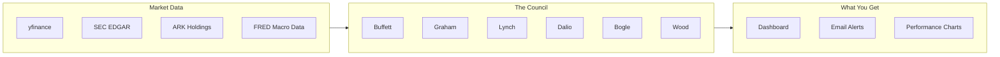
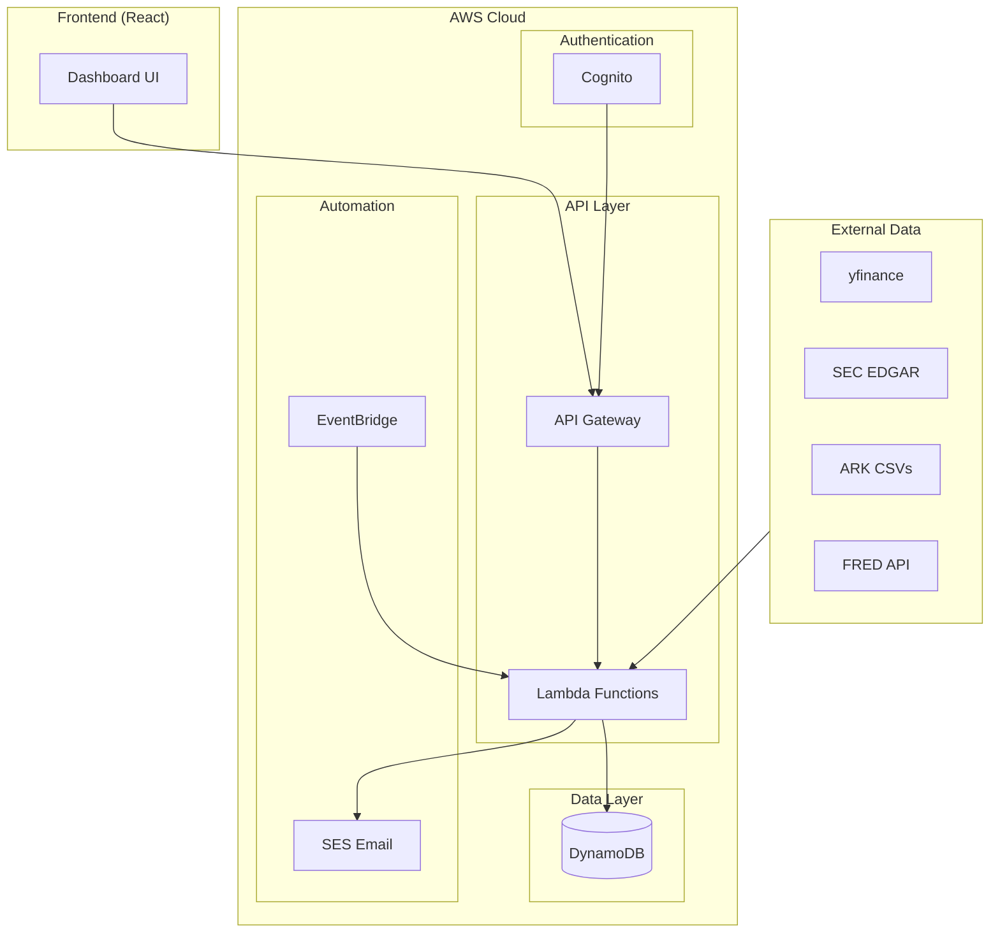
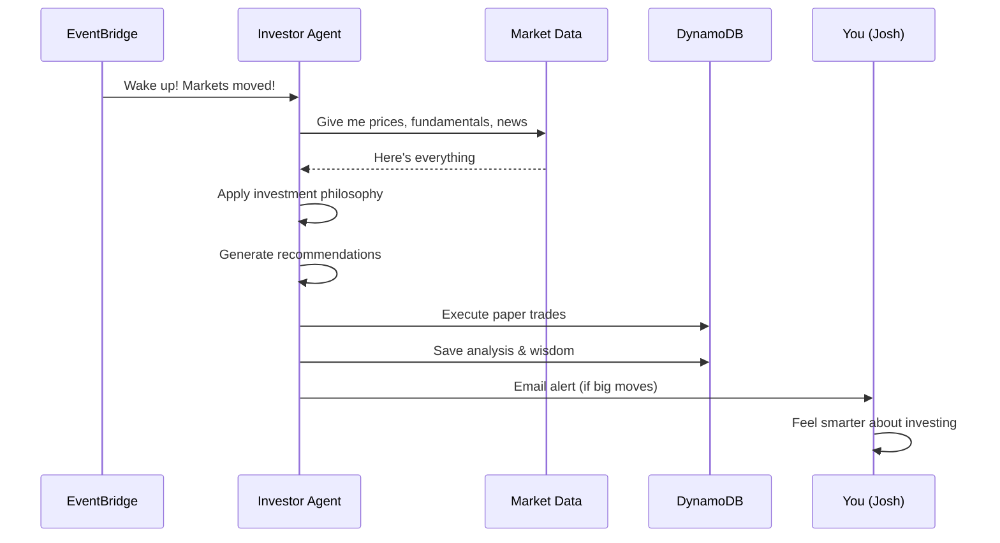
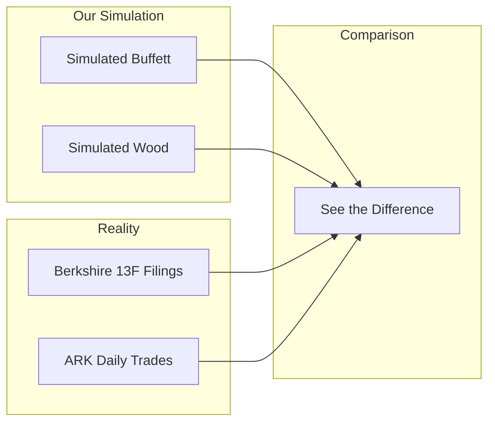

# Council

**Hey Josh!** Welcome to Council - your personal board of legendary investors who never ask for a management fee.

## What Is This Thing?

You know how you've always wondered "What would Buffett do?" or "Is Cathie Wood onto something with that TSLA position?"

Council answers those questions by simulating **6 legendary investors as AI agents**. Each one analyzes the market daily using their actual investment philosophy, manages a paper portfolio, and tells you what they're thinking.

No real money involved. No financial advice. Just six brilliant minds arguing about stonks.

## The Council Members

| Investor | Style | How Often They Trade | Risk Appetite |
|----------|-------|---------------------|---------------|
| **Warren Buffett** | "Be fearful when others are greedy" | Almost never | Medium |
| **Benjamin Graham** | The OG value guy, Buffett's mentor | Rarely | Conservative |
| **Peter Lynch** | "Invest in what you know" | Sometimes | Medium |
| **Ray Dalio** | Macro wizard, correlation nerd | Regular rebalancing | Conservative |
| **John Bogle** | Index funds or bust | Once a year maybe | Market-matching |
| **Cathie Wood** | DISRUPTION! INNOVATION! TESLA! | Very often | High |

## How It Works

Every day, each agent:

1. **Wakes up** (via AWS EventBridge, like a very punctual alarm clock)
2. **Reads the market** (prices, fundamentals, macro data)
3. **Thinks really hard** (applies their investment philosophy)
4. **Makes decisions** (buy, sell, or hold)
5. **Updates their portfolio** (paper trading, no real money)
6. **Reports to you** (dashboard + email alerts)

## Architecture (The Nerdy Bit)

Don't worry Josh, you don't need to understand this. But if your developer friends ask, show them this and they'll nod approvingly:

**Translation:** It's serverless, it's cheap (AWS Free Tier), and it won't break when you're not looking.

## The Agent Decision Flow

Here's what happens in each agent's brain every day:

## Reality Check Feature

This is the cool part. We don't just simulate what these investors *might* do - we compare against what they *actually* do:

- **Buffett**: We check Berkshire's quarterly 13F filings (SEC requires disclosure)
- **Cathie Wood**: ARK publishes their trades daily (they're not shy about it)

So you can see: "Huh, my simulated Buffett bought Apple, and real Buffett... also bought Apple. Nice."

## Features

### What's Working Now (MVP)

- 6 investor agents with distinct personalities and strategies
- Daily automated analysis and decisions
- Paper portfolio tracking (buy/sell/hold)
- Web dashboard showing everything
- Performance tracking over time
- Email alerts when agents make moves
- Multi-user support (your data is yours)
- Reality comparison (Buffett vs 13F, Wood vs ARK)

### What's Coming Later (v2)

- Backtesting ("what if Buffett had your portfolio in 2008?")
- Follow mode ("just copy what Dalio does")
- More agents (Soros, Icahn, maybe Burry for the memes)
- Social features (compare with friends)

## Agent Philosophy Cheat Sheet

### Warren Buffett
> "Price is what you pay, value is what you get."

- Looks for: P/E < 15, economic moat, consistent earnings
- Holds: Forever (or close to it)
- Trades: Maybe 2-3 times per year

### Benjamin Graham
> "In the short run, the market is a voting machine. In the long run, it's a weighing machine."

- Looks for: P/B < 1.5, current ratio > 2, dividend history
- Uses: Pure quantitative screening
- The guy who literally wrote "The Intelligent Investor"

### Peter Lynch
> "Know what you own, and know why you own it."

- Looks for: PEG ratio < 1, revenue growth
- Classifies stocks as: slow growers, stalwarts, fast growers, cyclicals, turnarounds, asset plays
- Made 29% annual returns at Magellan Fund

### Ray Dalio
> "He who lives by the crystal ball will eat shattered glass."

- Looks for: Economic indicators, asset correlations
- Style: Risk parity, all-weather
- Rebalances: Regularly based on macro conditions

### John Bogle
> "Don't look for the needle in the haystack. Just buy the haystack."

- Strategy: Buy index funds. Wait. That's it.
- Trades: Once a year to rebalance maybe
- The patron saint of "just buy VOO"

### Cathie Wood
> "We are on the right side of change."

- Looks for: Disruptive innovation, S-curve adoption, exponential growth
- Holds: Concentrated positions in high-conviction names
- Trades: A lot. Like, a lot a lot.

## Cost

This whole thing runs on AWS Free Tier, which means:

| Service | Free Tier Limit | Our Usage |
|---------|-----------------|-----------|
| Lambda | 1M requests/month | Plenty for 6 agents |
| DynamoDB | 25GB storage | More than enough |
| SES | 62k emails/month | Unless you spam yourself |
| API Gateway | 1M calls/month | Dashboard loads |

**TL;DR:** It's basically free unless this thing goes viral.

## Disclaimer

Josh, you know this, but just in case your lawyer friends ask:

**This is not financial advice.** These are AI simulations of investment philosophies for educational and entertainment purposes. The agents don't actually know anything - they're applying rules based on what these investors have publicly said and done.

Don't bet the farm on what simulated Ray Dalio says. Actually, don't bet the farm on what real Ray Dalio says either. Do your own research.

## Questions?

You know where to find me. And if something breaks, just remember: it worked on my machine.

---

*Built with love, Python, and an unhealthy fascination with legendary investors.*
